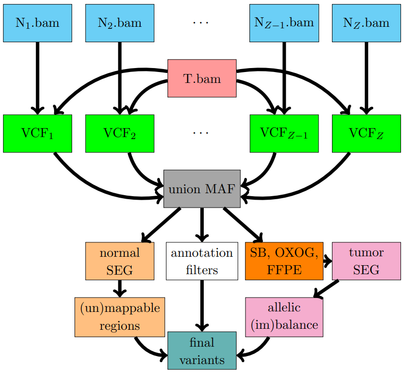

<div align="left">
<a href=""></a>
</div>

<!-- badges: start -->


[](https://doi.org/10.1093/narcan/zcab040)
[](https://www.repostatus.org/#active)
[](https://github.com/pllittle/UNMASC)
[](https://github.com/pllittle/UNMASC/commits/master)
<!-- badges: end -->

## What is this?

One goal of cancer genomics is to identify DNA variants specific 
to the cancer tissue within an individual. Perhaps a researcher 
would like to identify mutated genes and design a cancer treatment 
or therapy specific to that individual's cancer. These cancer 
variants are considered **somatic** or variants that cannot be 
inherited. Our normal tissue harbors inherited DNA variants called 
**germline** variants that are present and identical across all 
normal tissue. 

If one sequences an individual's matched normal DNA (e.g. from blood 
or adjacent tissue) and tumor DNA, one can identify both **germline** 
and **somatic** mutations and more importantly, distinguish between 
them. However, without the matched normal DNA serving as a control, 
the performance of somatic mutation callers (MuTect2, Seurat, Indelocator, 
Varscan, Strelka, Strelka2, etc.) drops off in terms of recall (sensitivity) 
and precision (positive predictive value). Perhaps the tumor sample:

* lacks an available matched normal (e.g. patient is unavailable, has leukemia)
* sample contamination, poorly sequenced normal, 
* insufficient budget to sequence both samples per patient

A third set of detected and unavoidable variants are false positives 
or **artifacts** that can arise from several sources including poor 
sequencing, sample storage, read misalignment to the reference genome, 
etc. UNMASC attempts to identify somatic variants from tumor samples 
without an adequate matched normal.

<p align="center">

<p align="center"><em>UNMASC workflow for a single tumor sample against 
Z unmatched normal controls. SB = strand bias, SEG = segmentation, 
OXOG = oxoG artifacts, FFPE = paraffin artifacts.</em></p>
</p>

## Description

This package is designed to filter and annotate tumor-only variant calls 
through the integration of public database annotations, clustering, and 
segmentation to provide the user with a clear characterization of each 
variant when called against a set of unmatched normal controls.

## Citation

Little, P., Jo, H., [Hoyle, A.](https://github.com/alanhoyle), 
[Mazul, A.](https://surgery.wustl.edu/people/angela-mazul/), 
[Zhao, X.](https://github.com/xiaobeizhao), Salazar, A.H., 
[Farquhar, D.](https://www.med.unc.edu/ent/directory/douglas-farquhar-md-mph/), 
[Sheth, S.](https://www.med.unc.edu/medicine/directory/siddharth-sheth-md/), 
[Masood, M.](https://www.linkedin.com/in/maheer-masood-03661685), 
Hayward, M.C., Parker, J.S., 
[Hoadley, K.A.](https://unclineberger.org/directory/katherine-hoadley/), 
[Zevallos, J.](https://www.linkedin.com/in/jpzevallosmd) and 
[Hayes, D.N.](https://hayeslab.lab.uthsc.edu/) (2021). 
UNMASC: tumor-only variant calling with unmatched normal controls. 
*NAR Cancer*, 3(4), zcab040. 
[[HTML](https://academic.oup.com/narcancer/article/3/4/zcab040/6382329), 
[PDF](https://academic.oup.com/narcancer/article-pdf/3/4/zcab040/40514892/zcab040.pdf), 
[Supplement](https://academic.oup.com/narcancer/article/3/4/zcab040/6382329#supplementary-data)]

## Installation

<details>
<summary>Click to expand!</summary>

R/RStudio code to check, install, and load libraries.

```R
all_packs = as.character(installed.packages()[,1])
pandoc = Sys.getenv("RSTUDIO_PANDOC")
build_vign = !is.null(pandoc) && file.exists(pandoc)

if( !("smarter" %in% all_packs) ){
	stop("Check https://github.com/pllittle/smarter for installation")
}

library(smarter)
cran_packs = c("devtools","Rcpp","RcppArmadillo","emdbook",
	"scales","BiocManager","parallel","doParallel",
	"data.table","grDevices","foreach")
bioc_packs = c("seqTools","Rsamtools","GenomicRanges",
	"IRanges")

smarter::smart_packDeps(
	cran_packs = cran_packs,
	bioc_packs = bioc_packs,
	github_packs = c("pllittle/UNMASC"),
	pandoc = pandoc,
	build_vign = build_vign)

```

</details>

## Inputs

* annotated variant calls (e.g. Strelka/Strelka2 + VEP)
* target capture bed file: contains contig, start position, end position columns
* centromere start/end bed file
* dict_chrom file: Run `samtools view -H tumor.bam` and save the output.
* tumor bam filename

## Workflow

UNMASC's benchmark samples were run with Strelka. Assuming 

* [Strelka](https://sites.google.com/site/strelkasomaticvariantcaller/) or [Strelka2](https://github.com/Illumina/strelka), 
* [GATK](https://github.com/broadinstitute/gatk), and
* [VEP](https://uswest.ensembl.org/info/docs/tools/vep/index.html) 

are installed along with corresponding dependencies (Perl, HTSlib, etc.), 
Linux commands are provided below to run these software for variant calling 
and annotation. Running our customized VEP annotation requires downloading 
a COSMIC database VCF. For example, CosmicCodingMuts.vcf.gz for GRCh37 with 
the latest release can be found at 
[here](https://cancer.sanger.ac.uk/cosmic/download?genome=37). 
We have instructed VEP to annotate variants with 1000 Genomes population 
allele frequencies, ExAC/gnomAD population allele frequencies, variant transcripts, 
impacts/consequences, and COSMIC counts with stable and legacy IDs.

Refer to our [comprehensive documentation](https://github.com/pllittle/UNMASC/blob/main/workflow/inputs.md) 
for setup, inputs, and execution. 

<!---
## Output

The column definitions of the sample output `tumorOnly_VCs.tsv` are described using the code below.

```
library(UNMASC)
print(UNMASC::readme_VC,right = FALSE)
```

## Vignette
To open the package vignette, run ```vignette("UNMASC")```.

-->

## Future directions

* Workflow containers
* Develop sample code and pipeline for
	* MuTect/MuTect2
	* ANNOVAR annotation code
* Applying UNMASC toward circulating plasma tumor cell DNA
* Identifying somatic mutations missed by tumors with matched normals

## FAQs


